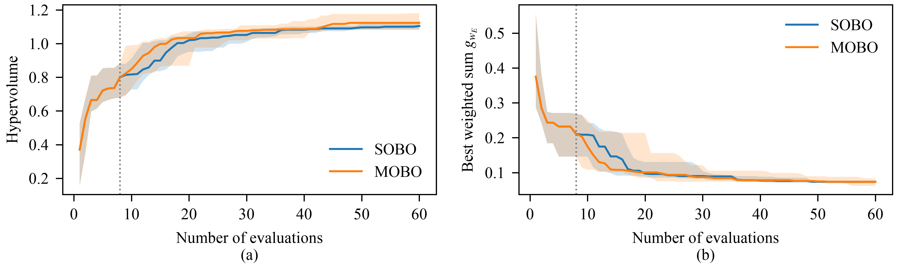

# Results summary (20 seeds)
> GP-fit fallbacks (quasi-random points): 0 of 5200 BO iterations.

## RQ1: solution quality

| metric | SOBO median | MOBO median | p (Wilcoxon) | p (Holm) | A12 (MOBO better) | effect |
|---|---|---|---|---|---|---|
| Hypervolume (higher is better) | 1.1046 | 1.1232 | 0.9273 | 0.9273 | 0.5900 | small |
| Best weighted sum g_wE (lower is better) | 0.0737 | 0.0737 | 0.1840 | 0.3680 | 0.4487 | negligible |

## RQ2: trade-offs

| test | n | statistic | p | p (Holm) |
|---|---|---|---|---|
| Spearman rho: f1 validity vs f2 consensus cost | 160 | 0.5928 | 0.0000 | 0.0000 |
| Spearman rho: f1 validity vs f3 convergence | 160 | 0.0995 | 0.2108 | 0.7947 |
| Spearman rho: f2 consensus cost vs f3 convergence | 160 | -0.1030 | 0.1951 | 0.7947 |
| Weight-coverage gap Delta_wV (median) | 20 | 0.0007 | 0.8373 | 1.0000 |
| Weight-coverage gap Delta_wC (median) | 20 | -0.0012 | 0.7368 | 1.0000 |
| Weight-coverage gap Delta_wT (median) | 20 | 0.0042 | 0.1589 | 0.7947 |

| evaluations to cover 4 weightings | median time SOBO (4 runs, s) | median time MOBO (1 run, s) |
|---|---|---|
| SOBO 240 vs MOBO 60 | 68.4237 | 189.7132 |

## RQ3: decisions (SOBO vs MOBO)

| metric | median | Q1 | Q3 |
|---|---|---|---|
| ARI | 1.0000 | 1.0000 | 1.0000 |
| Kendall_tau | 1.0000 | 1.0000 | 1.0000 |

