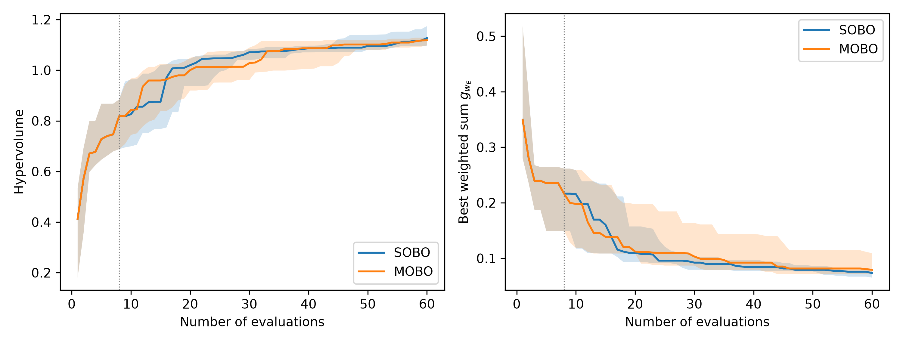

# Results summary (20 seeds)
> GP-fit fallbacks (quasi-random points): 0 of 5200 BO iterations.

## RQ1: solution quality

| metric | SOBO median | MOBO median | p (Wilcoxon) | p (Holm) | A12 (MOBO better) | effect |
|---|---|---|---|---|---|---|
| Hypervolume (higher is better) | 1.1271 | 1.1185 | 0.4749 | 0.4749 | 0.4200 | small |
| Best weighted sum g_wE (lower is better) | 0.0734 | 0.0793 | 0.0766 | 0.1532 | 0.3150 | medium |

## RQ2: trade-offs

| test | n | statistic | p | p (Holm) |
|---|---|---|---|---|
| Spearman rho: f1 validity vs f2 consensus cost | 160 | 0.5533 | 0.0000 | 0.0000 |
| Spearman rho: f1 validity vs f3 convergence | 160 | 0.0995 | 0.2108 | 0.6325 |
| Spearman rho: f2 consensus cost vs f3 convergence | 160 | -0.1536 | 0.0525 | 0.2626 |
| Weight-coverage gap Delta_wV (median) | 20 | 0.0014 | 0.6677 | 1.0000 |
| Weight-coverage gap Delta_wC (median) | 20 | 0.0000 | 0.7475 | 1.0000 |
| Weight-coverage gap Delta_wT (median) | 20 | 0.0190 | 0.0641 | 0.2626 |

| evaluations to cover 4 weightings | median time SOBO (4 runs, s) | median time MOBO (1 run, s) |
|---|---|---|
| SOBO 240 vs MOBO 60 | 64.8924 | 149.5146 |

## RQ3: decisions (SOBO vs MOBO)

| metric | median | Q1 | Q3 |
|---|---|---|---|
| ARI | 1.0000 | 1.0000 | 1.0000 |
| Kendall_tau | 1.0000 | 1.0000 | 1.0000 |

